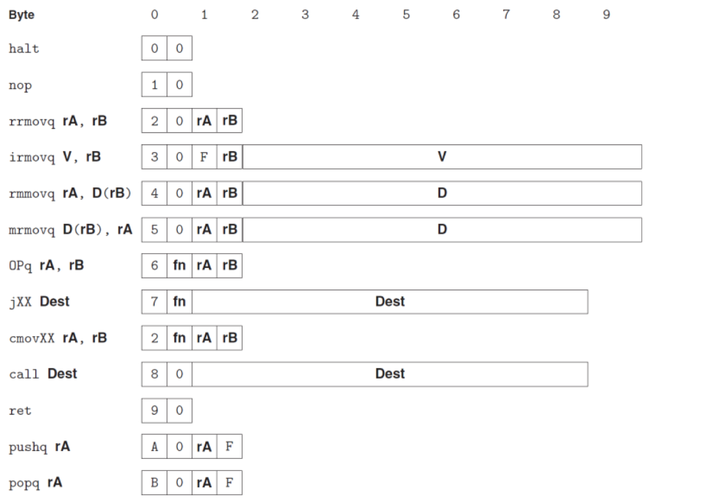

## 第一节：Y86 & RISC

### 一、学习目标：

我们在第三章时候学到的汇编，都是用英文字母写出来的，那么这个是适合人读的。那么对机器来讲，因为我们第四章开始要设计自己的CPU 了，对机器来讲还得变成二进制，那变成二进制我们在第三章的时候，使用的是gcc 给变好的二进制就给大家了。那么这个从 X86 的这个汇编到 X86 的二进制，是一个比较繁琐的过程。因为X86毕竟是一个工业级的这么一个汇编，所以它的这个二进制，它的那个二进制的那个编码就相对来讲比较复杂，不适合拿来上课教，所以我们就讲适合教学的Y86。

Y86是给我们第四章后边做一个铺垫。因为我们下来就是要写自己的这个汇编器，写自己的模拟器，这个是用 c 源来写，然后再来准备设计自己的CPU，这个是用一个硬件控制语言，就是我们书自己给出来的，叫HCL。用这个语言来设计一个自己的CPU，那么这个是我们第四章主要的这个目标。

### 二、程序员可见状态

- 程序员可见状态包括五个项目：寄存器、PC（程序计数器）、 CC（条件码）和Memory（内存），以及程序状态码。
- 前面的四样程序员可以看到的。到了后面我们在学第四章第五章的时候，我们会发现其实 CPU 在运行的时候，它内部还是有很多状态，它有很多内部的控制寄存器，这些是**程序员看不到的**。
- **寄存器**：Y86的寄存器是有15个（X86 是16寄存器）
- **条件码**：缺少了一个CF（CF代表的是无符号数运算是否溢出，如果溢出就是1）

- **程序状态码**：标识程序是否在正常运行，或者表示已经发生的特殊事件。

### 三、Y86编码

- Y86的编码是可变长的二进制来构成的，最短的指令只有1Byte，最长的有10Byte。
- `Halt`是停机指令、``Nop`是什么操作也不做的指令
- `fn`代表的是具体的功能是哪些，例如`jump`指令可能有好多种情况，就在`fn`上面体现差异。



- 寄存器的表示方法如下，用一个十六进制的数字表示即可。


#### 四、常见的算术运算

- 和X86不同，后面必须要跟两个寄存器（X86可以跟立即数、内存里面的值）
- 执行的效果是把运算的结果放到rB里面。
- 根据运算的结果，设置条件码（比如溢出了就会设置OF，SF就是加出来出现负数等）

```
addq rA, rB  60 rA rB
subq rA, rB  61 rA rB #Subtract (rA from rB)
andq rA, rB  62 rA rB
xorq rA, rB  63 rA rB
```

#### 五、Move操作

##### （一）四种类型

- 一共有四种类型，如下图所示：
- `rrmov`的时候有不同的条件码
- F代表的是没有寄存器。

```
rrmovq rA, rB
irmovq V, rB
rmmovq rA, D(rB)
mrmovq D(rB), rA
```

如下图所示：


- 此外，X86里面存在：imm(r0,ri,S)的四元组寻址模式，但是Y86不支持，只支持imm(r0)的模式
- 但是，我们可以让Y86用几条更加复杂的指令来表示这些指令。

##### （二）举例子

- 注意是Litter Endian！

```
irmovq $0xabcd, %rdx      30 F2 cd ab 00 00 00 00 00 00
rrmovq %rsp, %rbx         20 43
mrmovq -12(%rbp),%rcx     50 15 f4 ff ff ff ff ff ff ff
rmmovq %rsp,0x12345(%rdx) 40 42 45 23 01 00 00 00 00 00
```

##### （三）cMove条件移动

```
cmovle rA, rB   21 rA rB
cmovl  rA, rB   22 rA rB
cmove  rA, rB   23 rA rB
cmovne rA, rB   24 rA rB
cmovge rA, rB   25 rA rB
cmovg  rA, rB   26 rA rB
```

#### 六、Jump操作

- X86的`jump Lable`跳转的是PC Relative的相对地址，但是Y86为了简化处理，跳转的是8Byte的地址。
- Y86跳转一共有六种情况：


#### 七、程序的栈

- 有栈的操作的处理器，基本都是CICS类比计算机的标志，那RICS怎么实现呢？可能需要Move、并移动栈的指针，这需要软件来做。那RICS如果要Call怎么办？他有一个寄存器专门放返回的地址，那如果Call多次怎么办，就需要把寄存器的值放在栈里面，这都是软件来做，没有硬件指令。

- CPU简单了，速度执行起来就快，但是支持的功能就少了。

- 栈从高地址向低地址生长，可以进行push、pop的操作

- push的操作如下：

  - ```
    pushq rA  |a|0|rA|F|
    ```

  - `pushq`先把``%rsp` 减8

  - 然后把`rA`的寄存器值移动到`%rsp`指向的内存

  - 如果是`pushq %rsp`，他的意义就是：save old %rsp

- pop的操作如下：

  - ```
    popq rA  |b|0|rA|F|
    ```

  - 读取`rsp`指向的内存地址的内容

  - 保存寄存器rA

  - 把`%rsp`加8

  - 如果是`popq %rsp`，他的意义就是`movq (%rsp) %rsp)`

- 具体可以参考：[x86 - What is an assembly-level representation of pushl/popl %esp? - Stack Overflow](https://stackoverflow.com/questions/14968824/what-is-an-assembly-level-representation-of-pushl-popl-esp)

#### 八、Call和Ret

- Call指令会把下一个执行的地址放在栈里面，然后跳转
- ret指令就会把栈顶的地址读出来，然后调过去。

```
call Dest |8|0|  Dest(8Byte)  |
ret       |9|0|- - - - - - - -|
```

#### 九、Y86程序

- 下面展示的是把一个X86的汇编程序变成Y86的
- 注意这里的：`testq`指令的处理方法，Y86里面用AND来处理，哪怕重写了这个`rsi`寄存器的值，后面也会有新的值移动到这个寄存器，不会影响程序的运行。

```c
int Sum(int *Start, int Count)
{
	int sum = 0;
	while (Count) {
		sum += *Start;
		Start++;
		Count--;
	}
	return sum;
}
```

```
IA64 code
sum:
     movl $0, %eax 
     jmp .L2
.L3: 
     addq (%rdi), %rax
     addq $8, %rdi
     subq $1, %rsi
.L2: 
    testq %rsi, %rsi
   	jne .L3
    rep; ret
```

```
Y86 code
int Sum(int *Start, int Count)
sum:
     irmovq $8,%r8
     irmovq $1,%r9
     xorq %rax,%rax 
     andq %rsi,%rsi 
     jmp test 
loop:
    mrmovq (%rdi),%r10
    addq %r10,%rax
   	addq %r8,%rdi 
   	subq %r9,%rsi
test:
   	jne loop
   	ret 
```

#### 十、main函数怎么执行的

- 我们为了让main函数能够执行起来，需要添加一些头部内容

```
# Execution begins at address 0
 	.pos 0
 	irmovq	    stack, %rsp  # Set up stack pointer
 	call        main         # Execute main program
 	halt 				     # Terminate program
```

- `.pos0`表示这一部分的内容代码放在地址0
- `.algn 8`表示对齐，按照8来对齐，确保存储的地址的开头能够被8整除。

#### 十一、ISA

- 指令集体系结构：Instruction Set Architecture，分为两个层面：汇编语言抽象（处理器支持的汇编）和机器语言抽象（Byte层面的表示）
- ISA下层的是硬件（CPU设计、CHIP Layout）上面是编译器、操作系统、应用系统。
